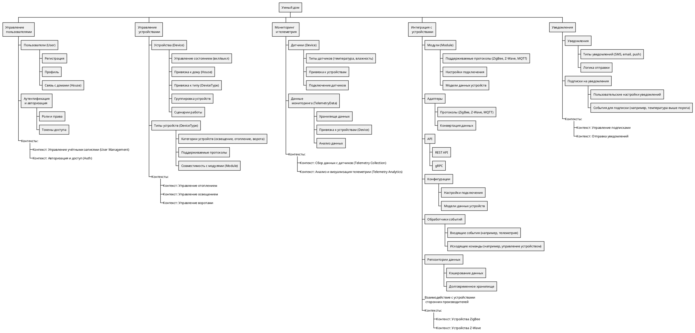

# Задание 1. Анализ и планирование

### 1. Описание функциональности монолитного приложения

**Управление отоплением:**

- Пользователи могут удалённо включать и выключать отопление в своих домах через веб-приложение.
- Система поддерживает управление температурой в доме на основе данных, поступающих от датчиков.

**Мониторинг температуры:**

- Пользователи могут просматривать текущую температуру в своих домах через веб-интерфейс.
- Система получает данные о температуре с датчиков, установленных в домах, посредством синхронных запросов.

### 2. Анализ архитектуры монолитного приложения

- **Язык программирования:** Java.
- **База данных:** PostgreSQL.
- **Архитектура:**
  - Монолитная, включает обработку запросов, бизнес-логику и работу с данными в одном приложении.
  - Взаимодействие организовано синхронно, что приводит к последовательной обработке запросов.
- **Масштабируемость:**
  - Ограничена, так как монолит сложно масштабировать по отдельным компонентам.
- **Развёртывание:**
  - Для внесения изменений необходимо останавливать и перезапускать всё приложение, что неудобно.
- **Подключение устройств:**
  - Каждая установка требует выезда специалиста, так как пользователи не могут самостоятельно подключать свои датчики.

### 3. Определение доменов и границ контекстов

**Выделенные домены и контексты (с учётом DDD):**

#### **Управление пользователями**
- **Контекст: Управление учётными записями (User Management):**
  - Регистрация и управление профилями пользователей.
  - Связь пользователей с домами (House).
- **Контекст: Авторизация и доступ (Auth):**
  - Аутентификация, роли и права пользователей.
  - Управление токенами доступа.

#### **Управление устройствами**
- **Контекст: Управление отоплением:**
  - Контроль состояния устройств отопления (включение/выключение).
  - Настройка сценариев работы.
- **Контекст: Управление освещением:**
  - Управление состоянием осветительных приборов.
  - Привязка устройств освещения к сценариям и группам.
- **Контекст: Управление воротами:**
  - Открытие/закрытие автоматических ворот.
  - Подключение и настройка устройств.

#### **Мониторинг и телеметрия**
- **Контекст: Сбор данных с датчиков (Telemetry Collection):**
  - Сбор данных от датчиков (температуры, влажности).
  - Привязка данных к устройствам и хранилищу.
- **Контекст: Анализ и визуализация телеметрии (Telemetry Analytics):**
  - Хранение и обработка телеметрии.
  - Визуализация данных для пользователей.

#### **Интеграция с устройствами**
- **Контекст: Устройства ZigBee:**
  - Подключение и настройка модулей по протоколу ZigBee.
- **Контекст: Устройства Z-Wave:**
  - Поддержка устройств, использующих протокол Z-Wave.
- **Контекст: Обработка событий:**
  - Управление входящими событиями (телеметрия, аварии).
  - Отправка исходящих команд к устройствам.

#### **Уведомления**
- **Контекст: Управление подписками:**
  - Настройка типов уведомлений (SMS, email, push).
  - Привязка событий для уведомлений (например, температура выше порога).
- **Контекст: Отправка уведомлений:**
  - Логика отправки уведомлений пользователям.

### 4. Проблемы монолитного решения

1. **Ограниченная масштабируемость:**
   - Монолитная архитектура не позволяет масштабировать отдельные части системы. Увеличение числа пользователей или устройств приведёт к ухудшению производительности.

2. **Сложность внесения изменений:**
   - Любое обновление требует модификации и тестирования всего приложения, что замедляет процесс разработки.

3. **Отсутствие самообслуживания для пользователей:**
   - Пользователи не могут самостоятельно подключать устройства к системе, что увеличивает затраты на обслуживание.

4. **Нет возможности легко добавлять новые функции:**
   - Расширение функционала (например, добавление управления освещением или камерами) требует серьёзных изменений в монолитной архитектуре.

5. **Уязвимость к сбоям:**
   - Сбой в одной части системы может вывести из строя всё приложение.

6. **Трудности с интеграцией:**
   - Система не поддерживает стандартизированные протоколы, что затрудняет подключение устройств сторонних производителей.

### 5. Визуализация контекста системы (диаграмма С4)

#### Контекстная диаграмма (Context Diagram):
Диаграмма отображает текущую монолитную систему и её взаимодействие с внешними элементами (пользователи, датчики, веб-приложение).

```plantuml
@startuml

!include https://raw.githubusercontent.com/vasilokb/plantUML/refs/heads/main/C4.puml

Person(user, "Пользователь", "Управляет устройствами в доме")
Person(admin, "Администратор", "Администратор, управляющий системой")

Boundary(monolith, "Монолитное приложение") {
  System(heatingSystem, "Тёплый дом", "Удалённое управление отоплением в доме")
  SystemDb(db, "PostgreSQL", "Хранит данные системы")
}

System_Ext(sensors, "Датчики", "Передают данные о температуре")
System_Ext(heatings, "Отопительные системы", "Выполняют команды по управлению отоплением")

' Взаимодействие пользователей с системой
Rel(user, heatingSystem, "Управление отоплением")
Rel(admin, heatingSystem, "Настройка системы")

' Взаимодействие монолита с внешними компонентами
Rel(heatingSystem, db, "Чтение и запись данных")
Rel(heatingSystem, heatings, "Команды для включения/выключения")
Rel(sensors, heatingSystem, "Передача данных о температуре")

@enduml

```

Диаграмма демонстрирует, что пользователи взаимодействуют с монолитной системой через веб-приложение, которое передаёт команды для управления отоплением и получения данных о температуре.

### 6. Схема доменов и контекстов в формате WBS



# Задание 2. Проектирование микросервисной архитектуры


**Диаграмма контейнеров (Containers)**

```plantuml
@startuml
!include https://raw.githubusercontent.com/vasilokb/plantUML/refs/heads/main/C4.puml
Person(user, "Пользователь", "Управляет устройствами в доме")
Person(admin, "Администратор", "Администратор, управляющий системой")
Boundary(sys, "SMART HOME") {
Container(apiGateway, "API Gateway", "Маршрутизация запросов и интеграция с микросервисами")
Boundary(auth, "Auth Service") {
Container(authService, "Auth Service", "Обеспечивает аутентификацию и авторизацию пользователей")
ContainerDb(userDb, "PostgreSQL", "Хранение данных пользователей")
}
Boundary(device, "Device Management Service") {
    System(deviceService, "Device Management Service", "Управление устройствами и сценариями")
    SystemDb(deviceDb, "PostgreSQL", "Хранение данных устройств")
}
Boundary(telemetry, "Telemetry Service") {
Container(telemetryService, "Telemetry Service", "Сбор и анализ данных от датчиков")
SystemDb(telemetryDb, "TimescaleDB", "Хранение телеметрических данных")
}
System(notificationService, "Notification Service", "Отправка уведомлений пользователям")
Boundary(integration, "Integration Service") {
System(integrationService, "Integration Service", "Интеграция с устройствами через протоколы ZigBee, Z-Wave, MQTT и др.")
SystemDb(integrationDb, "PostgreSQL", "Хранение данных о конфигурации устройств и протоколов")
}
SystemQueue(eventBus, "Kafka", "Обмен событиями между микросервисами")
}
System_Ext(sensors, "Датчики", "Передают данные о температуре и состоянии")
System_Ext(devices, "Устройства", "Устройства умного дома (освещение, отопление, ворота)")

Rel(user, apiGateway, "Запросы на управление устройствами")
Rel(admin, apiGateway, "Настройка системы")
Rel(apiGateway, authService, "Запросы на авторизацию")
Rel(authService, userDb, "Чтение и запись данных")
Rel(apiGateway, deviceService, "Управление устройствами и сценариями")
Rel(deviceService, deviceDb, "Чтение и запись данных об устройствах")
Rel(deviceService, eventBus, "Публикация событий устройств")
Rel(apiGateway, telemetryService, "Сбор и предоставление телеметрических данных")
Rel(telemetryService, telemetryDb, "Хранение телеметрических данных")
Rel(telemetryService, sensors, "Сбор данных с датчиков")
Rel(eventBus, notificationService, "Уведомления о событиях")
Rel(notificationService, userDb, "Чтение пользовательских настроек уведомлений")
Rel(apiGateway, integrationService, "Запросы на управление интеграцией устройств")
Rel(integrationService, integrationDb, "Чтение и запись данных конфигурации")
Rel(integrationService, devices, "Обмен данными через протоколы (ZigBee, Z-Wave и др.)")
Rel(integrationService, eventBus, "Публикация событий интеграции")
@enduml
```

**Диаграмма компонентов (Components)**
***Auth Service
```plantuml
@startuml
!include https://raw.githubusercontent.com/vasilokb/plantUML/refs/heads/main/C4.puml
Boundary(authService, "Auth Service") {
Component(authApi, "API", "REST API", "Принимает запросы на авторизацию")
Component(tokenManager, "Token Manager", "Компонент", "Генерация и проверка токенов")
Component(userRepo, "User Repository", "Компонент", "Доступ к данным пользователей")
}

SystemDb(userDb, "PostgreSQL", "Хранение данных пользователей")
Rel(authApi, tokenManager, "Генерация и проверка токенов")
Rel(tokenManager, userRepo, "Запросы к данным пользователей")
Rel(userRepo, userDb, "Чтение и запись данных пользователей")

@enduml

```
***Device Management Service
```plantuml
@startuml

!include https://raw.githubusercontent.com/vasilokb/plantUML/refs/heads/main/C4.puml

Boundary(deviceService, "Device Management Service") {
Component(deviceApi, "API", "REST API", "Принимает запросы на управление устройствами")
Component(stateManager, "State Manager", "Компонент", "Отслеживание и управление состоянием устройств")
Component(deviceRepo, "Device Repository", "Компонент", "Доступ к данным устройств")
}

SystemDb(deviceDb, "PostgreSQL", "Хранение данных устройств")
SystemQueue(eventBus, "Kafka", "Обмен событиями устройств")

Rel(deviceApi, stateManager, "Передача команд управления")
Rel(stateManager, deviceRepo, "Чтение данных устройств")
Rel(deviceRepo, deviceDb, "Чтение и запись данных устройств")
Rel(stateManager, eventBus, "Публикация событий устройств")

@enduml
```

***Integration Service
```plantuml
@startuml
!include https://raw.githubusercontent.com/vasilokb/plantUML/refs/heads/main/C4.puml
Boundary(integrationService, "Integration Service") {
Component(integrationApi, "API", "REST API", "Принимает запросы на интеграцию устройств")
Component(protocolManager, "Protocol Manager", "Компонент", "Управляет протоколами ZigBee, Z-Wave, MQTT и др.")
Component(configRepo, "Config Repository", "Компонент", "Доступ к данным конфигурации устройств")
}

SystemDb(integrationDb, "PostgreSQL", "Хранение данных о конфигурации устройств и протоколов")
System_Ext(devices, "Устройства", "Устройства умного дома")
SystemQueue(eventBus, "Kafka", "Обмен событиями интеграции")

Rel(integrationApi, protocolManager, "Запросы на управление протоколами")
Rel(protocolManager, configRepo, "Чтение и запись данных конфигурации")
Rel(configRepo, integrationDb, "Хранение данных конфигурации")
Rel(protocolManager, devices, "Обмен данными с устройствами через протоколы")
Rel(protocolManager, eventBus, "Публикация событий интеграции")

@enduml

```

***Telemetry Service
```plantuml
@startuml
!include https://raw.githubusercontent.com/vasilokb/plantUML/refs/heads/main/C4.puml
Boundary(telemetryService, "Telemetry Service") {
  Component(telemetryApi, "Telemetry API", "REST API", "Принимает запросы на доступ к телеметрическим данным")
  Component(dataCollector, "Data Collector", "Компонент", "Получает данные с датчиков через Integration Service")
  Component(dataAnalyzer, "Data Analyzer", "Компонент", "Обрабатывает и анализирует поступающие данные")
  Component(dataRepository, "Data Repository", "Компонент", "Управляет хранилищем телеметрических данных")
}

System(integrationService, "Integration Service", "Интеграция с устройствами через протоколы ZigBee, Z-Wave, MQTT")
SystemDb(telemetryDb, "TimescaleDB", "Хранение телеметрических данных")
SystemQueue(eventBus, "Kafka", "Обмен событиями между микросервисами")

Rel(telemetryApi, dataCollector, "Запросы на сбор данных")
Rel(dataCollector, integrationService, "Запрос данных с устройств через протоколы")
Rel(dataCollector, dataAnalyzer, "Передача собранных данных для обработки")
Rel(dataAnalyzer, dataRepository, "Сохранение обработанных данных")
Rel(dataRepository, telemetryDb, "Хранение данных")
Rel(dataAnalyzer, eventBus, "Публикация аналитики и событий")

@enduml
```


**Диаграмма кода (Code)**

```plantuml

```


